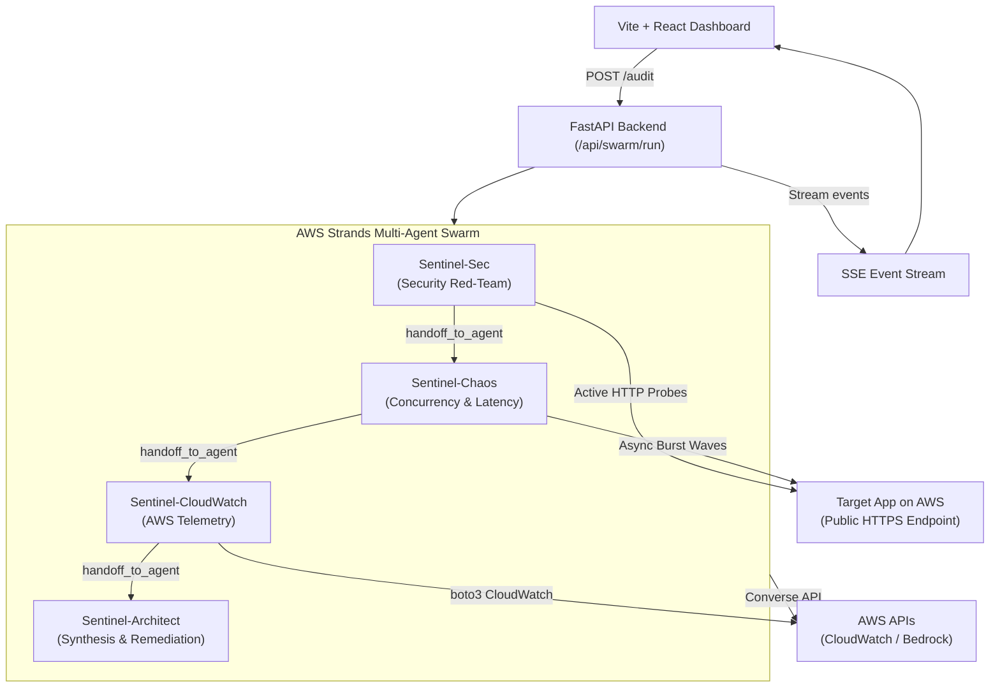

# Design: ShipSwarm AI

> Technical Architecture & Implementation Design

## 1. System Architecture

ShipSwarm AI is composed of an event-driven frontend dashboard communicating via HTTP and Server-Sent Events (SSE) with a FastAPI backend that hosts an AWS Strands Multi-Agent Swarm.



## 2. Component Design

### 2.1 Backend Modules (`src/shipswarm/`)
- `tools/security_prober.py`: Tool calling functions decorated with `@tool` for CORS, Security Headers, Auth token bypass heuristics, and error-disclosure checks using `httpx`.
- `tools/chaos_prober.py`: Asynchronous concurrent runner executing HTTP burst waves (10, 25, 50 calls) measuring min, mean, p50, p95, p99 latencies and HTTP status codes.
- `tools/aws_telemetry.py`: Boto3 queries for CloudWatch metrics (`AWS/ApiGateway`, `AWS/Lambda`, `AWS/ApplicationELB`) across a target time window.
- `swarm/agents.py`: Definition of the 4 Strands agents using `BedrockModel` with custom system prompts, specialized tools, and auto-injected `handoff_to_agent`.
- `swarm/orchestrator.py`: Initializer for `Swarm(nodes=[...], entry_point=sec_agent)` with event-listener hooks that emit structured SSE events.
- `server/app.py`: FastAPI app with `/health`, `/api/audit` (SSE streaming), and `/api/export-patch`.

### 2.2 Frontend Dashboard (`frontend/`)
- `SwarmConsole`: Real-time terminal displaying peer handoffs, agent reasoning, and executed tools.
- `ShipScoreRadar`: Multi-axis radar chart showing Security, Reliability, Performance, Observability, and Cost resilience.
- `TelemetryView`: Latency percentiles chart (p50, p95, p99) and CloudWatch metric cards.
- `RemediationPanel`: Interactive diff viewer showing the exact CDK/code patch with a copy/download action.

## 3. Data Models & Schemas

```python
from pydantic import BaseModel, HttpUrl
from typing import List, Dict, Optional, Literal

class AuditRequest(BaseModel):
    target_url: HttpUrl
    aws_region: Optional[str] = "us-east-1"
    app_type: Literal["api", "web", "serverless"] = "api"
    aws_service: Optional[str] = "apigateway"

class Finding(BaseModel):
    id: str
    severity: Literal["CRITICAL", "HIGH", "MEDIUM", "LOW", "INFO"]
    category: Literal["SECURITY", "PERFORMANCE", "RELIABILITY", "OBSERVABILITY"]
    title: str
    description: str
    evidence: str
    remediation_code: Optional[str] = None

class LatencyMetrics(BaseModel):
    sample_count: int
    p50_ms: float
    p95_ms: float
    p99_ms: float
    error_percentage: float

class SwarmEvent(BaseModel):
    event_type: Literal["agent_start", "tool_call", "handoff", "finding", "complete", "error"]
    agent_name: str
    message: str
    payload: Optional[Dict] = None

class AuditReport(BaseModel):
    target_url: str
    ship_score: int  # 0 to 100
    grade: Literal["A", "B", "C", "D", "F"]
    latency: LatencyMetrics
    findings: List[Finding]
    remediation_patch: str
```

## 4. Error Handling & Edge Cases

- **SSRF Protection:** Ensure target URLs do not resolve to `127.0.0.1`, `169.254.169.254` (AWS metadata service), or private RFC 1918 ranges before dispatching probes.
- **Target Unreachable / Timeouts:** If a target fails to respond within 5 seconds, retry once. If still failing, register an `UNREACHABLE_ENDPOINT` finding with 0 score penalty on availability and conclude the run safely.
- **Bedrock Throttling:** Built-in exponential backoff retry strategy via `ModelRetryStrategy` in Strands.
- **Swarm Loop Prevention:** Swarm configured with `max_handoffs=12` and `repetitive_handoff_detection_window=3` to prevent circular infinite handoffs.

## 5. Security & Isolation

- **Read-Only / Safe Probing:** Security tools only perform safe, non-destructive HTTP requests with standard payloads (no destructive database drops or mass fuzzing).
- **Environment Isolation:** AWS credentials used by Boto3 are restricted to read-only CloudWatch (`cloudwatch:GetMetricData`) and Bedrock model invocations (`bedrock:InvokeModel`).

## 6. Testing Strategy

- **Unit Tests:**
  - `test_security_prober.py`: Test security header checks and CORS validation with mock HTTP responses.
  - `test_chaos_prober.py`: Test latency percentile computation with synthetic response arrays.
  - `test_schemas.py`: Validate Pydantic models and SSRF protection regex.
- **Integration Tests:**
  - `test_swarm.py`: End-to-end swarm execution using a test HTTP target and mock Bedrock model.
  - `test_api.py`: FastAPI test client testing the SSE streaming generator.

## 7. Observability & Deployment (The Ship Gate)

- Deployable as a production service on AWS via AWS CDK / CloudFormation:
  - Frontend built and hosted on S3 + CloudFront / AWS Amplify.
  - Backend running containerized on AWS App Runner or AWS Lambda (via Mangum adapter).
- Documented proof of agent execution preserved in `deploy/aws_deployment_log.md` with timestamps and CLI outputs.
