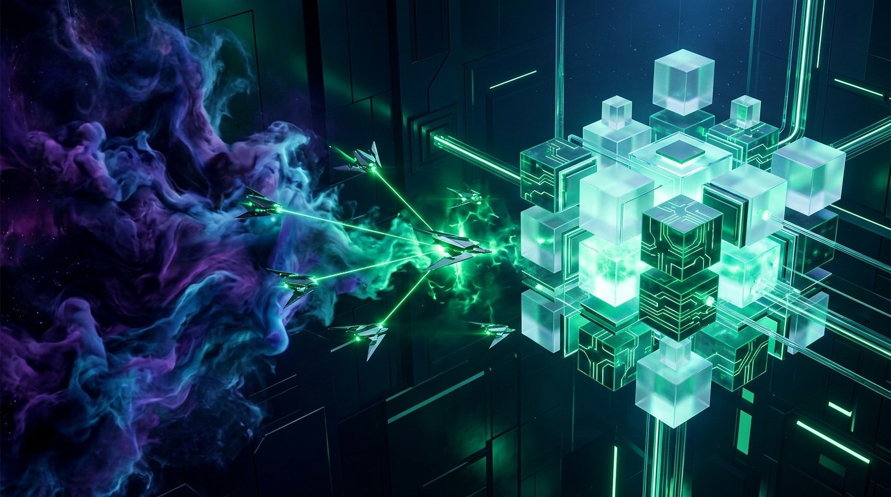

# 🎨 Official Cover Banner Prompt & Asset Guide

This document contains the prompt engineered for the **AWS Builder Center post** and the **GitHub Repository header**, along with the generated high-resolution banner.

---

## 🖼️ Generated Banner Preview

The banner has been generated in ultra-wide 16:9 aspect ratio and is saved at:
- `banner.jpg` (Repository root)
- `frontend/public/banner.jpg` (Frontend public assets)



---

## 📌 Master Prompt (ChatGPT Plus / DALL-E 3 & Imagen 3)

```text
A breathtaking, ultra-wide 16:9 cinematic banner for AWS Zero to Shipped hackathon. Dark obsidian futuristic environment with a dramatic transformation from left to right: on the left side, swirling ethereal nebula of amorphous deep purple, indigo and cyan cosmic smoke representing chaotic unformed code; in the center, sleek autonomous geometric sentinel drones with glowing emerald green laser beams organizing the chaos; on the right side, pristine crystalline 3D isometric AWS serverless cloud architecture consisting of luminous frosted glass cubes, glowing emerald circuit pathways, floating serverless monoliths, and laser-sharp fiber optic conduits. Unreal Engine 5 architectural render, volumetric lighting, photorealistic glass reflections, 8k resolution, clean minimal cybernetic aesthetic. No text, no letters, no words, no watermark.
```

---

## 🚀 Alternative for Midjourney v6

```text
/imagine prompt: cinematic ultra-wide banner, from amorphous chaotic liquid nebula on the left to crystalline glowing serverless cloud architecture on the right, autonomous sentinel drones guiding laser beams, translucent glass cubes and glowing emerald conduits, deep obsidian black background, volumetric lighting, Octane render, no text, no words --ar 16:9 --v 6.0 --style raw
```

---

## 🛠️ Instructions for Submission Posts

1. **Aspect Ratio**: Always use 16:9 landscape format for AWS Builder Center and DevPost cover headers.
2. **Text-Free Clean Slate**: Notice there is zero rendered text on the image. This guarantees zero AI typography glitches.
3. **Overlaying Titles**: You can use Figma, Canva, or Photoshop to drop your clean title (`ShipSwarm AI | Zero to Shipped`) in pure white (`#FFFFFF`) with a subtle drop shadow directly onto the upper-left or center-top area.
