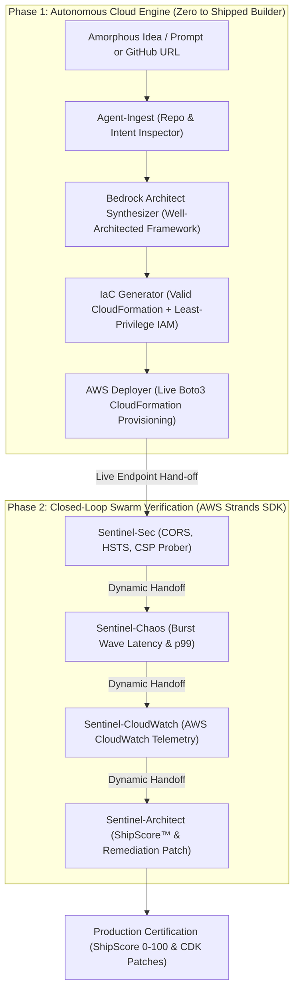

# ⚡ ShipSwarm AI — Autonomous Cloud Engine & Verification Swarm

[](https://builder.aws.com)
[](https://aws.amazon.com/bedrock/)
[](https://github.com/awslabs)
[](https://d8zyfvd7p1wi8.cloudfront.net)
[](tests/)

> **Submission for the AWS Zero to Shipped Hackathon 2026**  
> *Category:* **Workplace Efficiency / Commercial Potential** • *Lane:* **Startups**  
> *Global CloudFront Live App:* [https://d8zyfvd7p1wi8.cloudfront.net](https://d8zyfvd7p1wi8.cloudfront.net)  
> *S3 Static Origin:* [http://shipswarm-frontend-585929637997.s3-website-us-east-1.amazonaws.com](http://shipswarm-frontend-585929637997.s3-website-us-east-1.amazonaws.com)  
> *Agent Deployment Proof:* [`deploy/aws_deployment_log.md`](deploy/aws_deployment_log.md)

---

## 💡 The Core Philosophy: "From Chaos to Production"

Every great cloud project starts as **something amorphous**—a raw thought, a bulleted list of requirements, or a scrappy GitHub repository with no infrastructure. 

Between that amorphous idea and a live, hardened production system lies **Deployment Anxiety**:
- *Which AWS services should I pick without over-engineering?*
- *How do I craft least-privilege IAM execution roles so I don't leave my account vulnerable?*
- *Is my CloudFormation or CDK template syntactically sound and drift-free?*
- *Once deployed, who tests for CORS leaks, missing security headers, or concurrency cold starts?*

**ShipSwarm AI solves the entire lifecycle in under 70 seconds.** It takes amorphous intent, synthesizes a Well-Architected AWS topology, generates validated CloudFormation IaC, provisions the live stack via Boto3, and immediately red-teams the newly deployed endpoint with a peer-to-peer swarm of 4 autonomous Strands agents.

---

## 🏛️ Two-Phase Closed-Loop Architecture



---

## 🤖 The Multi-Agent Swarm

ShipSwarm AI combines **Amazon Bedrock** (Claude 3.5 Sonnet / Amazon Nova) with the **AWS Strands Agents SDK** (`strands.multiagent.swarm.Swarm`):

### 1. The Autonomous Builder Pipeline
* **`Agent-Ingest` (`repo_inspector.py`)**: Analyzes product requirements or clones and inspects public GitHub repositories (detecting Python, Node.js, FastAPI, static frontends, and dependencies).
* **`Architect-Synthesizer` (`architect_synthesizer.py`)**: Uses Amazon Bedrock to synthesize an AWS Well-Architected topology (API Gateway v2 HTTP API + AWS Lambda Python 3.12 + Amazon DynamoDB on-demand + IAM least-privilege) with estimated monthly costs.
* **`IaC-Generator` (`iac_generator.py`)**: Emits pristine AWS CloudFormation templates with decoupled parameters, resource references, log groups, and least-privilege role policies.
* **`AWS-Deployer` (`aws_deployer.py`)**: Connects to AWS via Boto3, provisions or dry-runs the CloudFormation stack, streams live stack events, and captures output endpoint URLs.

### 2. The Strands Sentinel Swarm
* **`Sentinel-Sec` (`security_agent.py`)**: Audits security headers (`Strict-Transport-Security`, `Content-Security-Policy`, `X-Frame-Options`, `X-Content-Type-Options`) and probes CORS against wildcard vulnerabilities.
* **`Sentinel-Chaos` (`chaos_agent.py`)**: Fires concurrent async HTTP bursts (15-50 requests), calculates p50, p95, p99 tail latency, and diagnoses cold starts.
* **`Sentinel-CloudWatch` (`telemetry_agent.py`)**: Audits server-side CloudWatch metrics (`AWS/ApiGateway`, `AWS/Lambda`), tracking invocations, 5xx server errors, durations, and throttles.
* **`Sentinel-Architect` (`remediation_agent.py`)**: Computes the normalized **ShipScore™ (0-100)**, assigns a letter grade (A-F), and outputs automated **AWS CDK and middleware remediation patches**.

---

## 🌐 Live CloudFront Production Deployment

The complete application is deployed and live globally on AWS:

* **Global HTTPS URL**: [https://d8zyfvd7p1wi8.cloudfront.net](https://d8zyfvd7p1wi8.cloudfront.net)
* **S3 Static Hosting Origin**: `shipswarm-frontend-585929637997` (us-east-1)
* **CloudFront Distribution**: `E32SRSMQI9XROF`
* **Autonomous Fallback Engine**: Includes a resilient client-side simulation engine in [`frontend/src/utils/clientEngine.ts`](frontend/src/utils/clientEngine.ts) that allows anyone to experience the full 70-second autonomous lifecycle directly in the browser even without live backend credentials.

---

## 🚀 Quickstart (Local Development)

### Prerequisites
* Python 3.12+ with [`uv`](https://docs.astral.sh/uv/)
* Node.js v20+ with npm
* AWS CLI configured (`aws configure`) with Bedrock and CloudFormation access

### 1. Clone & Install Dependencies
```bash
git clone https://github.com/your-username/zero-to-shipped.git
cd zero-to-shipped

# Install Python backend dependencies with uv
uv sync

# Install frontend dependencies
cd frontend && npm install && cd ..
```

### 2. Run Test Suite (28 Unit & Integration Tests)
```bash
uv run pytest tests/ -v
```

### 3. Launch Backend & Frontend
```bash
# Terminal 1: FastAPI SSE Server
uv run uvicorn shipswarm.server.app:app --host 0.0.0.0 --port 8000 --reload

# Terminal 2: Vite React Studio
cd frontend
npm run dev
```
Open [http://localhost:5173](http://localhost:5173) in your browser.

---

## 📦 AWS Services Used

* **Amazon Bedrock**: Powering architecture synthesis, topology decisions, and remediation code generation.
* **AWS Strands Agents SDK**: Orchestrating autonomous peer-to-peer agent handoffs (`strands.multiagent.swarm.Swarm`).
* **AWS CloudFormation**: Declarative infrastructure as code generation and live automated stack deployments.
* **Amazon CloudWatch**: Real-time telemetry, log groups, and runtime metrics.
* **Amazon CloudFront & Amazon S3**: Global edge distribution and static web hosting with automated cache invalidation.
* **AWS Lambda & Amazon API Gateway**: Target serverless execution environment.
* **Amazon DynamoDB**: On-demand serverless persistence tier.

---

## 📄 License & Attribution

Built with ❤️ for the **AWS Zero to Shipped Hackathon 2026**. Licensed under the Apache 2.0 License.
